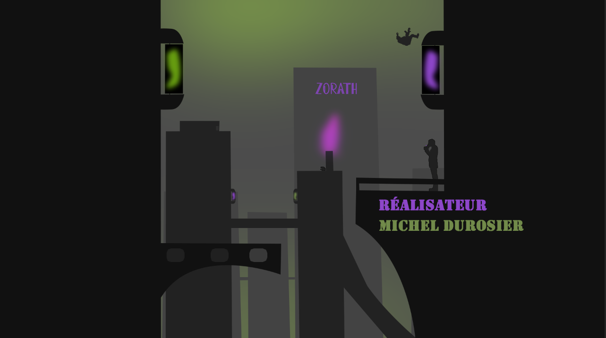
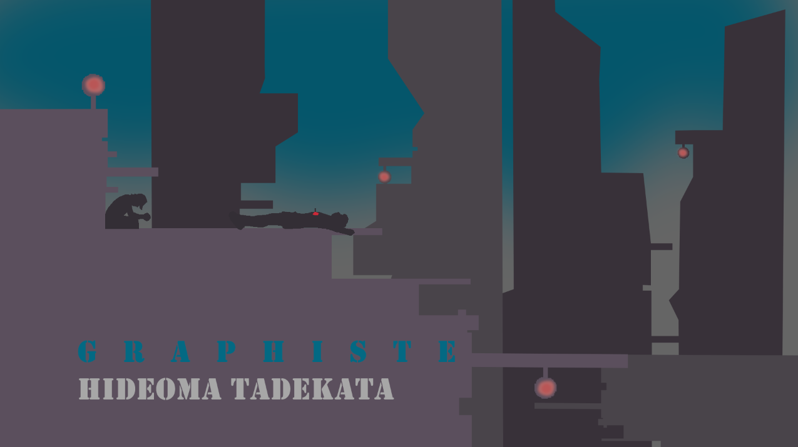
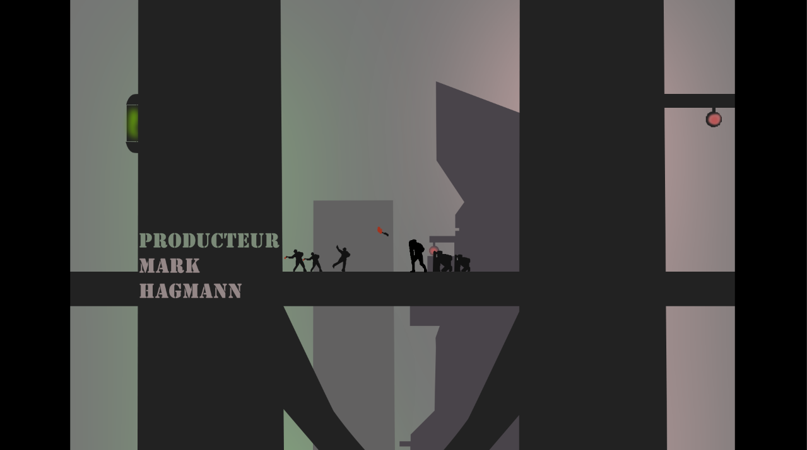
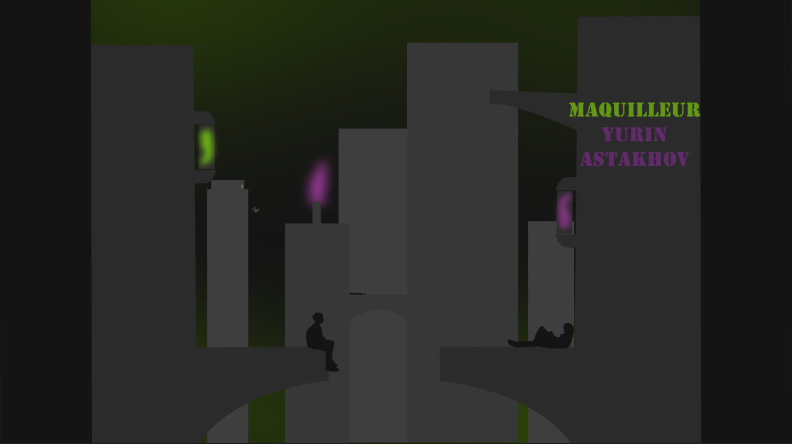
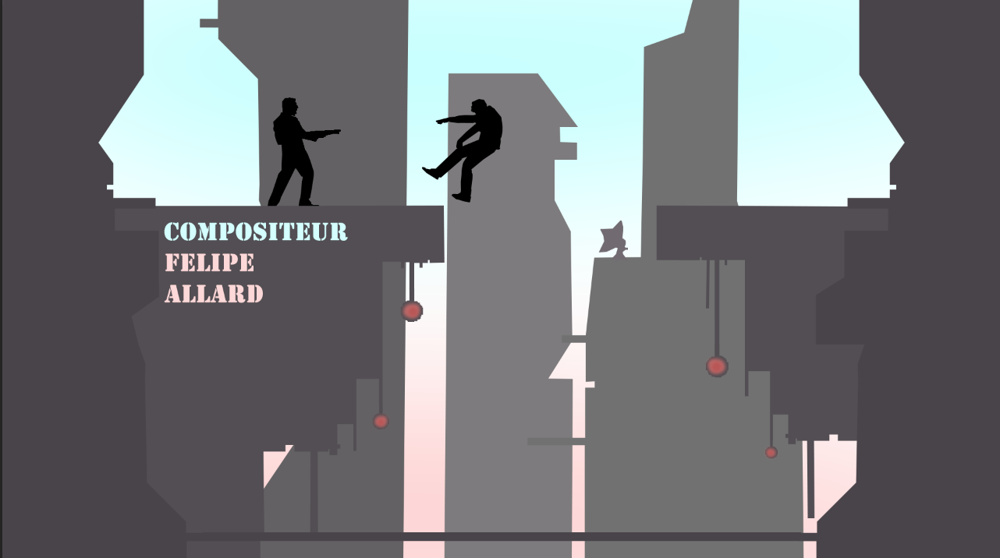

# Les Cendres d'Iliria

### img

| Image 1 | Image 2 | Image 3 |
| Image 4 | Image 5 | Image 6 |
|:---:|:---:|:---:|
|  |  |  |
|  |  |  |

### Nom de votre projet:
Les cendres d'iliria

### Mention académique ou personnel:
académique

### Réalisé dans le cadre du cours:
D'ilustration numérique

### Individuel ou en équipe:
équipe

### Nom de vos coéquipiers:
Jérémy Thériault

### Votre ou vos rôle(s) dans le projet:
faire 6 image chacun

### Logiciels ou techniques utilisées:
Photoshop et vectoriel

### Catégorie du projet:
Illustrations

### Description courte du projet (Résumé en 1 phrase):
Illustration de 6 image en vectoriel pour un intro de film fictif 

### Description du projet (Qu'est-ce que le prof vous a demandé de réaliser?) (2 phrases):
créé un intro de film entièrement en vectoriel et de faire 6 image chacun. On devait aussi créé une histoire a notre projet

### Description de votre projet (Qu'est-ce que vous avez fait?) (2 phrases):
On a créé une histoire comme demandé mais on a décidé de faire notre projet dans un style semblable au **pixel art**. Puisque le vectoriel n'est pas fait pour le **pixel art** c'était assez long de faire les personnages et les objets.
